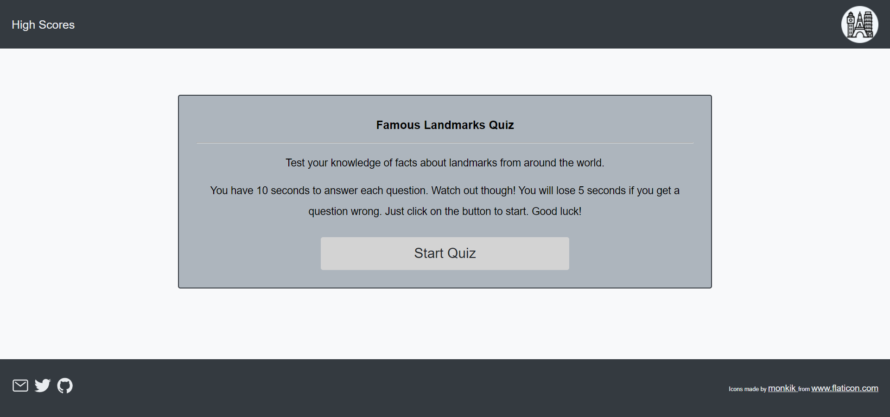

# famous-landmark-quiz

## Project Summary

In this project a timed coding quiz with multiple-choice questions was built. This app runs in the browser and features dynamically updated HTML and CSS powered by JavaScript code. It has a clean, polished, and responsive user interface.
 
 

## Deployed Page and Repository

[Deployed page](https://nsharma-uk.github.io/famous-landmark-quiz/)

[Repository](https://github.com/nsharma-uk/landmark-quiz)
 
 

## Technologies

- HTML
- CSS

- JavaScript

- GitHub
- Web APIs
   
   

## Project Details - User Story

AS AN employee with access to sensitive data

I WANT to randomly generate a password that meets certain criteria
SO THAT I can create a strong password that provides greater security
 
 

## Project Details - Acceptance Criteria

GIVEN I need a new, secure password

WHEN I click the button to generate a password

THEN I am presented with a series of prompts for password criteria

WHEN prompted for password criteria

THEN I select which criteria to include in the password

WHEN prompted for the length of the password

THEN I choose a length of at least 8 characters and no more
than 128 characters

WHEN asked for character types to include in the password

THEN I confirm whether or not to include lowercase, uppercase, numeric, and/or special characters

WHEN I answer each prompt

THEN my input should be validated and at least one character type should be selected

WHEN all prompts are answered

THEN a password is generated that matches the selected criteria

WHEN the password is generated

THEN the password is either displayed in an alert or written to the page

 

## Screenshots

Deployed page

 
 
 
Prompt asking for input of chosen password length

 
 
Prompt asking if user wants lowercase in their password

Alert message telling user that they need to select at least one criteria.

 

## Authored by

 
N Sharma
 
 

## Contact

Email: nsharma711@gmail.com  
GitHub: [github.com/nsharma-uk](https://github.com/nsharma-uk) 
Twitter: [@NSharmaUK](https://twitter.com/NSharmaUK)
