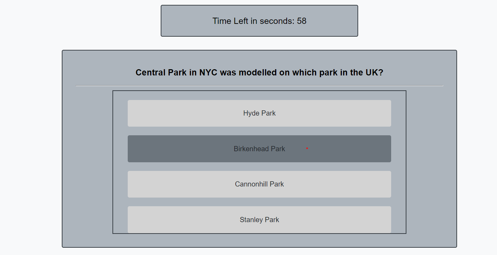
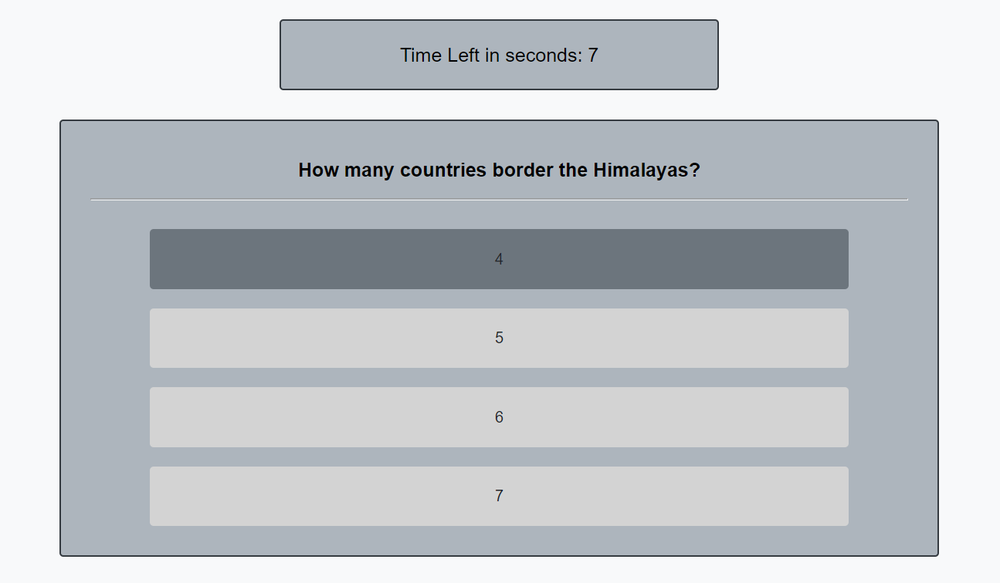

# famous-landmark-quiz

## Project Summary

In this project a timed coding quiz with multiple-choice questions was built. This app runs in the browser and features dynamically updated HTML and CSS powered by JavaScript code. It has a clean, polished, and responsive user interface.
 
 

## Deployed Page and Repository

[Deployed page](https://nsharma-uk.github.io/famous-landmark-quiz/)

[Repository](https://github.com/nsharma-uk/landmark-quiz)
 
 

## Technologies

- HTML
- CSS

- JavaScript

- GitHub
- Web APIs
   
   

## Project Details - User Story 
 
AS A user

I WANT to take a timed quiz on landmarks around the world that stores high scores

SO THAT I test my knowledge compared to other users

 
 

## Project Details - Acceptance Criteria
 

GIVEN I am taking a quiz

WHEN I click the start button

THEN a timer starts and I am presented with a question

WHEN I answer a question

THEN I am presented with another question

WHEN I answer a question incorrectly

THEN time is subtracted from the clock

WHEN all questions are answered or the timer reaches 0

THEN the game is over

WHEN the game is over

THEN I can save my name and my score

 
 

## Screenshots

  
Example 1 of a multiple choice question

 
 
Example 2 of a multiple choice question

 
 
The score page to submit the results to scoreboard

 

## Authored by

 
N Sharma
 
 

## Contact

Email: nsharma711@gmail.com  
GitHub: [github.com/nsharma-uk](https://github.com/nsharma-uk) 
Twitter: [@NSharmaUK](https://twitter.com/NSharmaUK)
